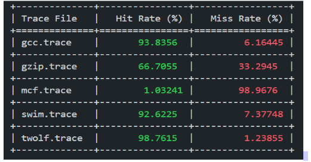

# Cache Simulation

## Project Overview
This project simulates the behavior of a set-associative cache system under varying configurations to evaluate cache performance in terms of hit and miss rates. The main goal is to observe how changes in cache size, block size, and associativity influence cache behavior when processing memory trace files.
## Generalization of the Project

This project is a flexible and reusable simulation of a set-associative cache, which can be used with any memory trace files to evaluate cache performance. The cache simulator is designed to handle various configurations of cache size, block size, and associativity, making it applicable to a wide range of scenarios involving memory access patterns.

While the project includes specific memory trace files to demonstrate the functionality, the system is built in a way that it can accept any other trace files following the same format (i.e., containing memory addresses). The purpose of using these particular test files is to provide a consistent basis for evaluation and comparison across different cache configurations, allowing us to draw meaningful conclusions about the impact of cache parameters on performance.
### Why These Test Files?

The provided test files were chosen for the following reasons:
- **Representative Workloads**: The trace files simulate typical memory access patterns from real-world applications, offering a practical way to analyze the behavior of the cache under realistic conditions.
- **Diverse Memory Access Patterns**: These test files include a variety of access patterns that help illustrate how different cache parameters (size, block size, associativity) affect hit/miss rates across different scenarios.
- **Benchmarking**: Using standardized trace files enables the comparison of results with similar cache simulators or studies, ensuring the observations made can be validated and compared against existing benchmarks.

By using these trace files, we are showcasing the effectiveness of our cache design under different conditions. However, the code is fully customizable and can be extended to simulate cache behavior for any memory trace files as long as they follow the format: `Access Type`, `Memory Address`, and `Instructions Since Last Access`.

You can easily modify the input to test your own memory trace files and analyze the cache's performance in different workloads.

### How to Use with Other Test Files

To use your own memory trace files, simply place them in the same directory as the script and ensure they follow the correct format:
- **Access Type**: (optional for this project, ignored)
- **Memory Address**: 32-bit hexadecimal memory address.
- **Instructions Since Last Access**: (ignored in this project)

The cache simulator will process your input files and provide hit/miss rate statistics for your custom workload.

## Features
- 4-way Set Associative Cache with configurable cache sizes and block sizes.
- LRU (Least Recently Used) replacement policy for cache management.
- Hit/miss rate analysis for five memory trace files.
- Graphical and tabular results for various cache configurations.

## Requirements
The following Python packages need to be installed to run the simulator:
``` bash
pip install colorama tabulate pandas openpyxl
```
# Code Structure
Implementation of the cache is done using an object-oriented design in Python, adhering 
to the set-associative cache architecture with a Least Recently Used (LRU) replacement 
policy. The cache simulates hit and miss behavior without storing actual data, focusing on 
tag matching and the valid bit
## Classes
- Cache:Represents the cache structure. Configurable with cache size, block size, and associativity. Includes methods to:
  - check(): Check if a memory access results in a hit or miss.
  - evictor(): Evict a block based on the LRU replacement policy.
  - lru_handling(): Update the LRU counters after each memory
- Block:Represents an individual block in the cache, including attributes like:
  - tag: Cache tag for matching.
  - valid: Bit to indicate if the block is valid.
  - lru_counter: Counter to track the Least Recently Used status of the block.

## Main Functions:
- parta(): Simulates a 4-way set-associative cache with a fixed size of 1024KB and a block size of 4 bytes.

- partb(): Varies the cache size from 128KB to 4096KB and analyzes the hit/miss rates for each size.

- partc(): Varies the block size from 1 to 128 bytes while keeping the cache size fixed at 1024KB.

- partd(): Varies the associativity from 1-way to 64-way, keeping the cache size fixed at 1024KB.

## Trace File Format
Each trace file consists of:

- Access Type: Either a load ('l') or store ('s'). This is ignored in the simulation.
- Address: A 32-bit memory address (in hexadecimal) which is used to check for cache hits or misses.
- Instructions Since Last Access: Number of instructions executed between consecutive memory accesses. This is also ignored in the simulation.

## How to Run the code
1. Clone the repository and navigate to the project directory.
``` bash
gitclone https://github.com/gouravanirudh05/Cache-Simulator.git
cd Cache-Simulator
```
3. Run the respective parts of the simulation:
``` bash
python code.py
```
## Output
- The simulation outputs hit and miss rates for each memory trace file.
- Results are presented in tables and graphs.

# Results:
## Part A: 4-Way Set Associative Cache (1024KB cache size, 4-byte block size)
For the default configuration of 1024KB cache size and 4-byte block size, we calculated the 
number of sets (cache lines) using the formula  
#### Cache size (in bytes) = (block-size) * (associativity) * (no.of cache lines) 
We obtained the following hit and miss rates for the trace files: 
Observations include the hit and miss rates for each trace file under this default configuration.


## Part B: Cache Size Variation (128KB to 4096KB)
- Miss rates change as cache size increases.

## Part C: Block Size Variation (1 byte to 128 bytes)
- Miss rates are analyzed for different block sizes with a fixed cache size of 1024KB.

## Part D: Associativity Variation (1-way to 64-way)
- This experiment explores how increasing associativity impacts hit and miss rates.

# Conclusion
The experiments highlight the trade-offs involved in cache design. Increasing cache size 
and associativity generally improves hit rates, but with diminishing returns. Block size 
also plays a crucial role, with optimal configurations depending on the specific memory 
access patterns of the program. 

# Excel Results for each trace file
You can view the hit/miss rates in Excel format:
- [Part A Results](./Results\Fixed_CacheSize.xlsx)
- [Part B Results](./Results\Changing_CacheSize.xlsx)
- [Part C Results](./Results\Changing_blocksize.xlsx)
- [Part D Results](./Results\Changing_associativity.xlsx)

# License
This project is licensed under the MIT License. See the [LICENSE](./LICENSE) file for details.
